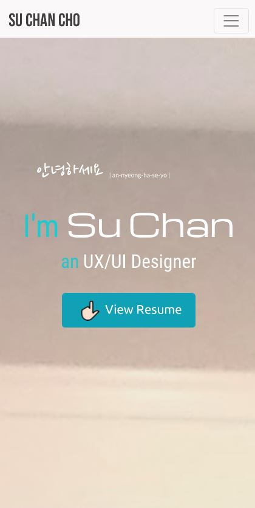
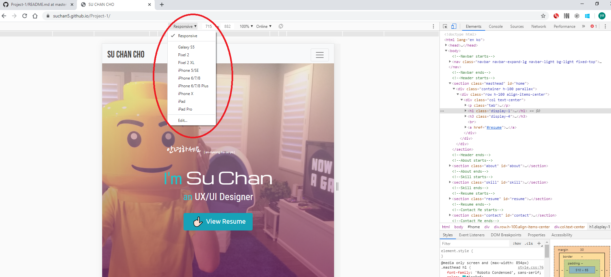
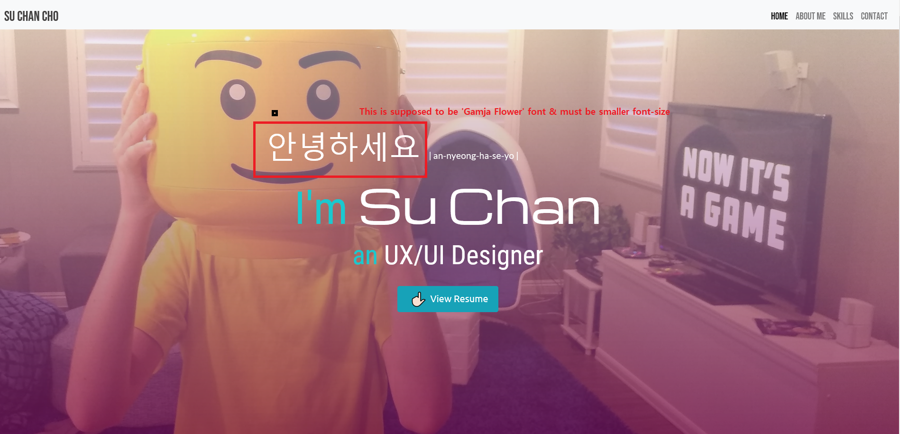

# User Centric Front End Development Project 
This website is designed and developed as a static portfolio website with responsive design for different media sizes.

Focus is on presenting myself to recruiters and employers who are interested and considering to hire me as their UX/UI designer. 
# UX
Goals for myself : To present and show the skills and background I have. Ultimate goal is to get hired.

Goals for users : To browse and explore throughout the portfolio website to find out more about me and my skills. Ultimate goal is to access whether I am the suitable candidate, and to hire if I am the right fit for the job.

Based on the goals identified, this website is focusing on the three strategies as below :  
* Easy to use
* Presentable
* Informative
# Features  
### Existing Features  
#### 'Home' page  
* A navbar is placed to show the overview of the contents of the website. It is fixed at the top of the website so that users can access to it at anytime while exploring.
* A short and brief self-introduction about myself is placed on the landing page.
* Modern typographies are chosen and a friendly background image is used to attract users, and to make them stay to explore further.
* A 'View Resume' button is placed to link directly to Resume page, for those users who would like to go straight to the point.
#### 'Aabout Me' page
* I used different colors and typographies to play with words and give an emphasis on the keywords. It enables the users to read the keywords at a glance.
* Shaking image effect is used to give motions to the static website.
* Colorful icons are added to give styles and friendly feelings to the users.
#### 'Skills' page 
* Skill bars are added to show what skills I used to create this website. Users can imply that I am able to perform tasks with these skills, and can access whether I am the suitable candidate with skills that they are looking for.
* Resume page is presented directly below to the skill bars, which enables the  users to further learn about my educational and career background, as well as other qualifications and features.
* A download button is placed for users to download my full CV with more credible infomation.
* Image, typography, icons and colors are used to give colorful design effects, and also to give consistency in theme continuous from the previous page.
#### 'Contact' page
* A contact form is placed for users to contact me or leave an inquiry directly to me in the website. Tasks can be performed simply by filling and submiting the contact form.
* Placeholders is shown to guide users for the required information which they need to fill-in in the contact form. It enables easier user experiences.
* More ways to contact are available in the footer. Once clicked, icons will redirect the users to my Github page, Linkedin, Instagram, or trigger a call or an email.
* An image, typography, icons, and colors are added to give friendly feelings to the users and to give consistency in theme throughout the website.
* Copytight declared in the footer.
### Features left to implement
Portfolio page will be added and updated for my future projects.
# Technologies used
* HTML5 - it was used to build the structure of the website.
* CSS3 - it was used to give design effects and style to the website. Also, media query was used for responsive design.
* [Bootstrap 4.4](https://getbootstrap.com) - it was used for structure and style for the website with responsive design for different media sizes.
* [Google Fonts](https://fonts.google.com)  - it was used for different typographies for design effects.
* [Font Awesome](https://fontawesome.com) - it was used for the social media icons and an email icon placed in the footer.
* [Flaticon](https://www.flaticon.com) -  it was used for the rest of colorful icons in the portfolio websites.
# Testing
#### Links & Buttons
The main purpose of the test on links and buttons is to ensure that there are no broken links upon clicking.
* Navbar - I clicked on the navbar menus to test if the links could bring users to the clicked pages.
* Buttons - the 'View Resume' button on the landing page was tested if it was able to bring users to the Resume page (For other buttons, I did not assign any links)
* Icons & Phone Number in the footer - :
   * Social Media Icons were tested whether they were able to redirect users to the respective pages.
   * Email Icon was tested whether it successfully activated the default mail client on the computer for sending an email.
   * Phone number was clicked to test whether it was able to trigger a call, when the users access the website using their phones.
#### Images
The main purpose of the test on the images is to ensure that there are no broken images or images not shown.
* When it was tested in my sister's iPhone XR, the background image in the main landing page was not shown. (In other friends' and family's phones and laptops, it was nicely presented.)  
This issue is still remained unresolved :  

#### Responsive Design
The main purpose of the test on the responsive design is to ensure that the website works well and looked organized in different sizes of the media.
* Used 'Inspect' function from Google Chrome to test the responsive design in different sizes of the media :  

   * Navbar and the Skills page worked well.
   * However, the landing page was not responsive according to the different sizes. A Korean phrase which was placed on the top of the landing page was shown hidden under the navbar. Also the 'View Resume' button was shown outside of the landing page. To resolve this, I tried to rebuild the landing page with Jumbotron in Bootstrap, but it could not resolve the problem. In the end, I used media query so that they can nicely fit in responsively. 
   * Also, Contact page looked not organized when it was shown on smaller sizes of the media. I changed the grid to 'col-sm' in Bootstrap and also align the text and 'Submit' button to the center. After that, it looked more organized for users' view.
* All the font-size, margin, padding in CSS have been rectified from 'px' to 'em' or '%'.
* I used media query in CSS to ensure that all are responsive in different media sizes.
* I tested the website on ['Am I Responsive'](http://ami.responsivedesign.is) to virtually see if it worked well before sending out the deployed URL for further testing on friends' and family's laptop and phones.
* I sent the deployed URL to friends and family to test whether the website works responsively without broken images or links in different media sizes (Test was done on laptops, Galaxy S2, iPhone XR, Oppo R11, Galaxy Tab A, and etc).
* I tested on different browsers (Google Chrome, Safari, Firefox, Internet Explorer) to ensure that the website worked well :
   * Google Chrome - no issues detected as this is where I designed and developed the website.
   * Safari - no issue detected.
   * Firefox - no issue detected.
   * Internet Exporer - The typography used in Korean phrase was not appeared as I designed. I used 'Gamja Flower' font from Google Fonts. However it was not shown as 'Gamja Flower' and the font size was also appeared bigger.    
This issue is still remain unresolved :  

## Deployment
Github page was used to host my portfolio website. It was deployed directly from the master branch, and therefore any chages made was promptly updated accordingly.  

[My Portfolio Website](https://suchan5.github.io/Project-1/)    
[My Github Page](https://github.com/suchan5/Project-1)

#### Error faced while deploying  
All the images were not shown when I accessed to the website using the deployed URL. I deemed it as a timing issue and waited for up to few hours, but it was not working. Subsequently, I un-deployed and re-deployed. However it was still not showing the images.

It was due to the dashes(/) put in front of the images. For example :
```html
<imr src="/img/bg.jpg">
```
The error was successfully resolved after removing the dashes.
## Credit
#### Images
* [Unsplash](https://unsplash.com) - for the background image used in the landing page & the Lego block image used in Resume page
* [Dribble](https://dribbble.com/shots/5025015-Lego-pop-art) - for the Lego Popart image used in Contact page 
#### Ackowledgement
* [W3schools](https://www.w3schools.com/howto/howto_css_shake_image.asp) - for the shaking image effect used in About Me page
* [WIX](https://www.wix.com/website/templates/html/portfolio-cv) - many good examples in WIX gave me inspirations and motivation for my portfolio website
   * [Reference 1](https://www.wix.com/website-template/view/html/1887?siteId=5d2a8f2b-b726-45f6-9db1-92596eccc9d2&metaSiteId=28a077e8-599e-452b-959b-5946202e015b&originUrl=https%3A%2F%2Fwww.wix.com%2Fwebsite%2Ftemplates%2Fhtml%2Fportfolio-cv)
   * [Reference 2](https://www.wix.com/website-template/view/html/2435?siteId=533aef86-18c8-4427-be63-ae8a2501f68a&metaSiteId=764460cd-c7fe-4f6a-a067-003262b73bd4&originUrl=https%3A%2F%2Fwww.wix.com%2Fwebsite%2Ftemplates%2Fhtml%2Fportfolio-cv)
   * [Reference 3](https://www.wix.com/website-template/view/html/2180?siteId=b7d73208-d8ee-4340-bf37-b47688493e45&metaSiteId=b4078cf5-3191-4555-99b8-4afb3f61a921&originUrl=https%3A%2F%2Fwww.wix.com%2Fwebsite%2Ftemplates%2Fhtml%2Fportfolio-cv%2F2)


